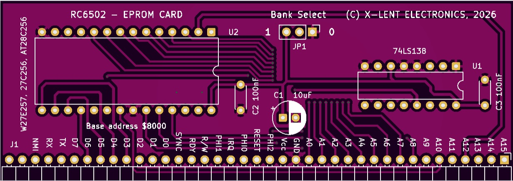
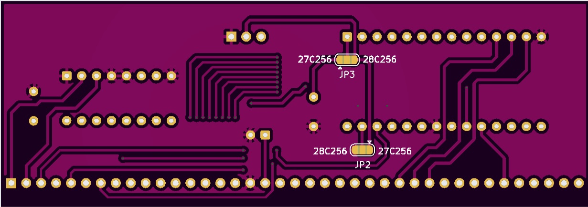
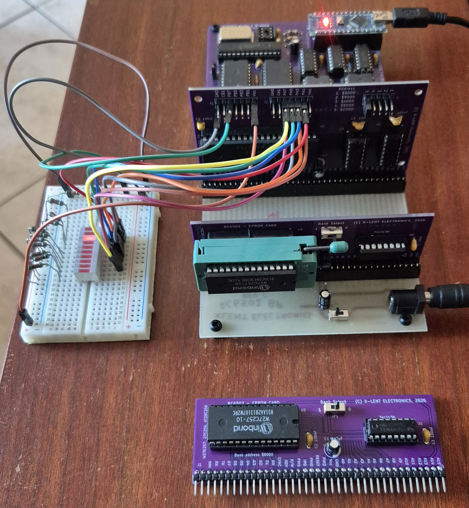


# RC6502 EPROM Card

The RC6502 EPROM Card is a dedicated ROM add-on card designed to provide stable, non‑volatile program storage for the RC6502 Apple 1 Replica SBC. 



# How to Build
The RC6502 EPROM Card has a few components. Of cours the EPROM it self, a 74LS138 address decoder to determine the card address, a switch or jumper, two 100nF decoupling capacitors, 10uF electrolyte capacitor and 39 pin edge connector.



## ZIF Socket
When you want to easy replace EPROM's or when you are in developing mode, it can be handy to install a ZIF socket. Unfortunately, a ZIF socket was not taken into account during the PCB design phase. However, you can still install a ZIF socket. This can be done in two ways, by placing the ZIF socket in an IC socket and mounting C2 flat, or by mounting the ZIF directly onto the PCB. In the latter case, it is more convenient to mount the Bank Select switch and C2 on the back.

# Select EPROM Device 
The RC6502 EPROM Card supports multiple 32KB EPROM types, including the AT28C256, W27C256, W27E257, and the classic 27C256 UV‑EPROM. On the bottom side of the PCB, a set of solder jumpers determines which EPROM is installed. These jumpers configure the card for either an AT28C256 or a x27x256 EPROM. Select the correct jumper option to ensure proper working of the EPROM Card.

On the bottom side of the PCB are two solder pads. By connecting the pads with a small dot of solder you select the used EPROM, AT28C256 or W27C256, W27E256, 27C256 type.



# EPROM Card Address
The EPROM card maps the EPROM cleanly into the upper memory region of the RC6502 Apple 1 Replica SBC address space, at base address $8000.  

At the hardware level, the EPROM Card integrates seamlessly with the RC6502 backplane. Address decoding ensures that ROM is only active in the intended memory range, preventing bus conflicts with RAM or I/O devices. The board exposes a standard 28‑pin EPROM socket, allowing easy reprogramming and swapping of firmware during development. Because the card outputs stable, fast ROM reads, it is ideal for system monitors, bootloaders, BASIC interpreters, and custom firmware.

# Bank Select
The RC6502 EPROM Card divides the installed 32 KB EPROM into two independent 16 KB banks. The Bank Select switch determines which half of the EPROM is mapped into the CPU’s address space.
When the switch is set to Bank 0, the EPROM exposes the first 16 KB block. When flipped to Bank 1, the card instead maps the second 16 KB block. Only one bank is active at a time, ensuring clean and conflict‑free memory decoding.

This design allows you to store two separate firmware images inside a single EPROM, such as EhBASIC in Bank 0 and some other program in Bank 1. Switching between them requires no reprogramming: simply toggle the bank‑select switch and reset the system.

# EhBASIC
A EhBASIC.bin file is available to fit in the EPROM card and to be run from address $8000.  When you have programed the Bin file in the EPROM, you run EhBASIC from EPROM by entering in WoZmon **8000 R**.
EhBASIC will start up with its regular Cold / warm message. Press C and enter a valid memory amount, mostly used is 20480.  

## WOZMON Command
The EhBASIC version for the RC6502 has a command to switch back to WoZmon. Enter at the EhBASIC prompt **WOZMON** to switch back to WoZMon prompt.
Just enter **8000 R** followed by W for Warm boot and you are back in EhBASIC. Your BASIC program will be still in memory and ready to use.  

## CLS Command
To avoid every time typing a PRINT command with VT100 Escape sequins to clear the screen a new command CLS is available in this version of EhBASIC. 

# In practice
The image shows an EPROM card with ZIF socket and with EhBASIC in the EPROM working together with the [RC6502 MC6821 PIA IO card](https://github.com/xlentelectronics/RC6502_MC6821_PIA_IO_Card).






